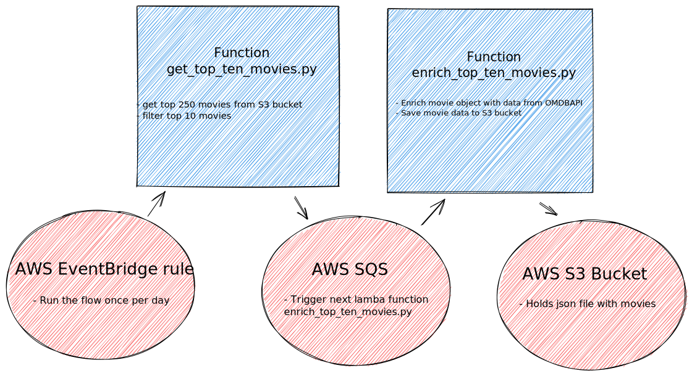

<!-- markdownlint-disable-file no-inline-html first-line-h1 -->
<div align="center">

# The Cat Assignment 😼

The AWS journey to become a member of cats.

</div>

---

- [The Cat Assignment 😼](#the-cat-assignment-)
  - [Overview](#overview)
  - [Features](#features)
  - [How to deploy](#how-to-deploy)

## Overview

This repository contains two Python serverless functions and AWS CloudFormation template to create AWS Serverless Application (SAM).



## Features

- **Infrastructure as Code**: You can deploy or destroy this system very quickly thanks to CloufFormation template and AWS SAM.
- **Customizable**: You can pass or override following `sam` parameters:
  - BucketName
  - SqsQueueName
  - TopMoviesUrl
  - OmdbApiUrl
  - OmdbApiSecretName
  - OmdbApiSecretKey (required!)
  - LambdaLogLevel
- **CI/CD Pipelines**: This repo is using Github Actions to run CI/CD pipelines:
  - Tools [`Pylint`](https://www.pylint.org), [`Black`](https://github.com/psf/black), [`Isort`](https://pycqa.github.io/isort/), [`Mypy`](http://mypy-lang.org) and [`Bandit`](https://bandit.readthedocs.io) are used for static code analysis.
  - [`Pytest`](https://pytest.org) and [`Coverage`](https://coverage.readthedocs.io) are used for unit testing.
  - Auto-bump and automatic release creation using [`Commitizen`](https://commitizen-tools.github.io/commitizen/) and [`conventional commits`](https://www.conventionalcommits.org/en/v1.0.0-beta.2/).
  - On every new release, application in AWS is automatically deployed using `aws-sam-cli`. OmdbApiSecretKey is passed using Github Actions secrets.

## How to deploy

**Prerequisites** are:

- An AWS root user (not recommended) or IAM user with enough permissions to administrate AWS account (for example policy `AdministratorAccess`).
- AWS access keys for CLI

1. Install `awscli` and `aws-sam-cli` (preferably in Python venv).

    ```shell
    python3 -m venv .venv
    source .venv/bin/activate
    pip install awscli aws-sam-cli
    ```

2. Grab your AWS access key and configure `awscli`.

   ```shell
    aws configure
    AWS Access Key ID [None]: <access_key>
    AWS Secret Access Key [None]: <secret_access_key>
    Default region name [None]: us-east-1
    ```

3. Create S3 bucket for AWS Serverless Application Model (`aws-sam-cli`).

   ```shell
   aws s3api create-bucket --bucket the-cat-assignment-us-east-1-sam-bucket --object-ownership BucketOwnerEnforced --region us-east-1
   aws s3api put-public-access-block --bucket the-cat-assignment-us-east-1-sam-bucket --public-access-block-configuration "BlockPublicAcls=true,IgnorePublicAcls=true,BlockPublicPolicy=true,RestrictPublicBuckets=true"
   ```

4. Build the Lambda function code.

   ```shell
    sam build
    ```

5. Deploy the AWS SAM application.

    ```shell
    sam deploy --config-env the_cat_assignment --parameter-overrides ParameterKey=OmdbApiSecretKey,ParameterValue=<OMDB_API_SECRET_KEY>
    ```

## Cleanup

To delete an AWS SAM application and the artifacts created by sam use following command:

```bash
sam delete --config-env the_cat_assignment
```
